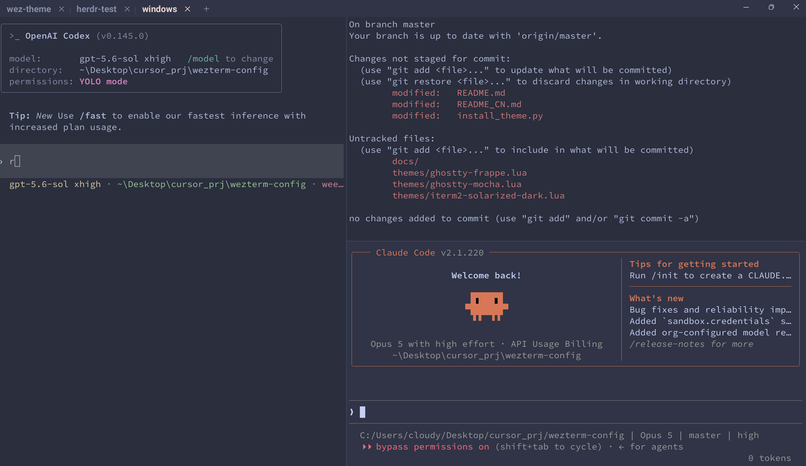

# WezTerm Config for Windows

[中文](./README_CN.md)

A Windows-focused [WezTerm](https://wezfurlong.org/wezterm/) setup with six installable themes, Cmder/Clink integration, practical pane and tab shortcuts, and reliable CJK font fallback. **Ghostty Frappé is the default theme.**



## Highlights

- Six dark themes with distinct palettes and window treatments
- Smart `Ctrl+C`: copy selected text, otherwise send an interrupt
- Right-click paste and Windows Terminal-style pane shortcuts
- CRLF-to-LF paste normalization for remote shells and editors
- CJK, Latin, and symbol font fallback
- Borderless tab bar with integrated Windows caption buttons

## Themes

| Theme | Appearance |
|---|---|
| `ghostty-frappe` **(default)** | Soft Catppuccin Frappé pastels with compact, seamless opaque chrome |
| `ghostty-frappe-pill` | Frappé palette with tmux-style rounded pill tabs and an accent-filled active tab |
| `ghostty-mocha` | Deeper black-purple Catppuccin Mocha with seamless opaque chrome |
| `iterm2-solarized-dark` | Low-glare cyan-blue Solarized Dark with restrained Acrylic blur |
| `luna-night` | Deep-purple translucent Acrylic |
| `tabby-darcula` | Solid Tabby / JetBrains Darcula dark theme |

> The `ghostty-*` and `iterm2-*` names describe palette and appearance inspiration. All themes run in WezTerm; they are not those applications or their macOS default themes.

## Install

Requirements:

- [WezTerm](https://wezfurlong.org/wezterm/) stable ≥ 20240101
- Python ≥ 3.10
- Git, or download the repository as a ZIP and run the commands from the extracted directory
- Recommended fonts: Source Code Pro, JetBrains Mono, and Microsoft YaHei; missing fonts fall back automatically

> **Shell path:** every theme resolves Cmder automatically in this order: `WEZTERM_CMDER_INIT` → `CMDER_ROOT` → `where cmder` → common install paths → plain `cmd.exe`. Put Cmder on `PATH` or set `CMDER_ROOT` (Cmder's official variable) to enable Clink/Cmder; if nothing is found, WezTerm still starts a normal `cmd.exe`. To use PowerShell or WSL instead, edit `config.default_prog` in the selected theme before installing it.

```powershell
# Get the project
git clone https://github.com/cloudy-liu/wezterm-config.git
cd wezterm-config

# List themes
python install_theme.py list

# Install the default Ghostty Frappé theme
python install_theme.py install

# Install a different theme
python install_theme.py install luna-night

# Show the active global theme
python install_theme.py status
```

For example, use `{ 'pwsh.exe', '-NoLogo' }` for PowerShell 7 or `{ 'wsl.exe' }` for WSL as the `config.default_prog` value.

Copy mode is the default. Before installation, the script backs up the existing `%USERPROFILE%\.wezterm.lua` as `.wezterm.lua.bak-<timestamp>`. Reload WezTerm or open a new window to apply the theme.

To apply repository edits immediately, use link mode; Windows may require Developer Mode or Administrator privileges. The global config then points to the selected repository file, so do not move or delete the repository.

```powershell
python install_theme.py install ghostty-frappe --mode link
```

## Key Bindings

| Shortcut | Action |
|---|---|
| `Ctrl+C` | Copy the selection, or send `Ctrl+C` when nothing is selected |
| `Ctrl+V` / right-click | Paste from the clipboard |
| `Ctrl` + left-click | Open a hyperlink |
| `Alt+Shift++` / `Alt+Shift+_` | Split the current pane horizontally / vertically |
| `Alt+←/→/↑/↓` | Navigate between panes |
| `Alt+Shift+←/→/↑/↓` | Resize the current pane |
| `` Alt+` `` / `` Alt+Shift+` `` | Cycle to the next / previous pane |
| `Ctrl+Shift+W` | Close the current pane |
| `Ctrl+B` / `Ctrl+Shift+R` | Rename the current tab |
| `Ctrl+Shift+←/→` | Move the current tab left / right |
| `Ctrl+Shift+T` | Open a new tab |

## Customize

Edit `themes/<name>.lua`, then reinstall it in copy mode. In link mode, repository edits apply directly.

- Shell: `config.default_prog`
- Fonts: `config.font` and `config.font_rules`
- Colors: `config.color_schemes`
- Shortcuts: `config.keys` and `config.mouse_bindings`

## License

[MIT](./LICENSE)
