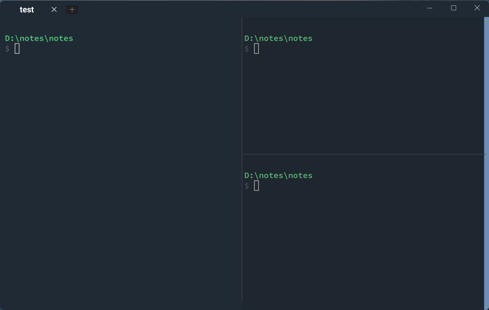

# 🐱 WezTerm Config
[English](./README_EN.md) | [中文](./README.md)



An out-of-the-box [WezTerm](https://wezfurlong.org/wezterm/) terminal configuration, built for Windows users.

Coming from Tabby? This config already aligns your most-used habits.

---

## 😫 What Problems Does It Solve?

WezTerm's default configuration isn't very Windows-friendly. This config fixes these pain points one by one:

| Problem | How This Config Fixes It |
|---------|--------------------------|
| Pasting into remote vim/git commit produces double-spaced lines | Automatically converts CRLF to LF |
| CJK characters show garbled or fall back to ugly fonts | 6-level font fallback chain for both CJK and Latin |
| AI tool dim text (e.g. Cursor Thinking) is too thin to read | Half-intensity text uses OneDark comment gray instead of ExtraLight weight |
| Closing a window always triggers a confirmation dialog | Window close confirmation disabled |
| No right-click paste | Right-click to paste, just like Tabby |
| Ctrl+C can only copy OR interrupt, not both | With selection → copy + "Copied" toast; without → send Ctrl+C interrupt |
| No convenient shortcuts for pane splits | Aligned with Windows Terminal: Alt+Arrow to navigate, Alt+Shift+Arrow to resize |
| Can't rename tabs | Ctrl+B or Ctrl+Shift+R to rename |
| Admin mode tab titles have long "Administrator:" prefix | Automatically stripped |
| Title bar wastes space | No system title bar, integrated buttons in tab bar |
| Missing glyph popups are annoying | Missing glyph warnings disabled |
| ANSI green too dark or too bright | Tuned to emerald green — readable without eye strain |

## ✨ Features

- **Color scheme** — Custom `Tabby-JetBrains-Darcula` dark theme
- **Fonts** — Source Code Pro → JetBrains Mono → Consolas → Microsoft YaHei → Segoe UI Symbol → Noto Sans Symbols 2
- **Smart Ctrl+C** — Copy when text is selected (with "Copied" toast for 2s), send interrupt when nothing is selected
- **Right-click paste** — Just like Tabby
- **Pane splits** — Windows Terminal-style shortcuts (create/navigate/resize/close)
- **Tab management** — Rename, move, centered titles, admin prefix stripped
- **Borderless title bar** — Integrated min/max/close buttons
- **CRLF → LF paste fix** — No more double-spacing in remote shells
- **Non-blinking cursor** — SteadyBar style, less visual noise
- **Scrollbar** — Enabled by default for easy scrollback browsing

## ⌨️ Key Bindings

### 🏷️ Tab Management

| Shortcut | Action |
|----------|--------|
| `Ctrl+B` / `Ctrl+Shift+R` | Rename current tab |
| `Ctrl+Shift+←/→` | Move tab left/right |
| `Ctrl+Shift+T` | New tab |

### 🪟 Pane Splits

| Shortcut | Action |
|----------|--------|
| `Alt+Shift++` | Split pane horizontally |
| `Alt+Shift+_` | Split pane vertically |
| `Alt+←/→/↑/↓` | Navigate between panes |
| `Alt+Shift+←/→/↑/↓` | Resize pane |
| `Ctrl+Shift+W` | Close current pane |

### 📋 Copy & Paste

| Shortcut | Action |
|----------|--------|
| `Ctrl+C` | Copy selection / Send Ctrl+C interrupt |
| `Ctrl+V` | Paste from clipboard |
| Right-click | Paste from clipboard |
| `Ctrl` + Left-click | Open hyperlink |

### 🔧 Other

| Shortcut | Action |
|----------|--------|
| `Ctrl+Shift+D` | Debug overlay |

## 📦 Installation

### 🔗 One-step install (recommended)

Open an elevated Command Prompt and create a symlink:

```cmd
mklink "%USERPROFILE%\.wezterm.lua" "C:\your\path\to\wezterm-config\.wezterm.lua"
```

This keeps your config in sync with the repo — just `git pull` to update.

### 📂 Manual copy

```powershell
copy C:\your\path\to\wezterm-config\.wezterm.lua %USERPROFILE%\.wezterm.lua
```

> WezTerm picks up the config on next launch — no extra steps needed.

## 🔧 Customization

The config file has clear section comments — edit what you need:

- **Shell** — Change `config.default_prog` (currently cmd.exe + Cmder; switch to PowerShell or WSL)
- **Fonts** — Edit `config.font` and `config.font_rules`
- **Colors** — Modify `Tabby-JetBrains-Darcula` in `config.color_schemes`
- **Key bindings** — Add/remove entries in `config.keys` and `config.mouse_bindings`

## 📋 Requirements

- [WezTerm](https://wezfurlong.org/wezterm/) stable ≥ 20240101
- Recommended fonts: Source Code Pro, JetBrains Mono, Microsoft YaHei (works without them — falls back gracefully)

## 📄 License

[MIT](./LICENSE)
